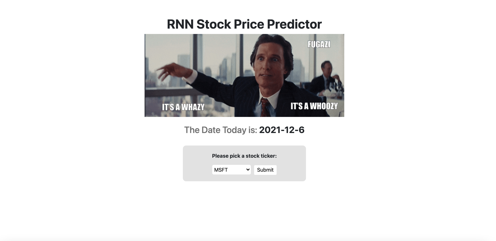
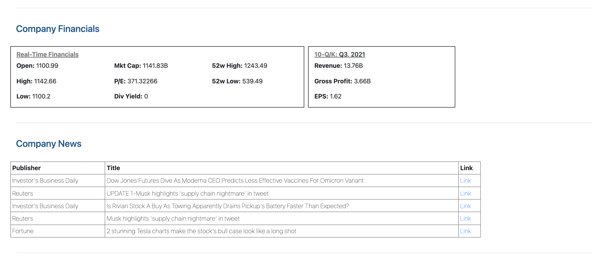

# ANN-Stock-Price-Predictor

The stock market is more volatile than ever. In an attempt to capture and analyze these movements, I have developed an ANN Stock Price Predictor. This Flask application allows users to select a stock and a visualization based on historical closing prices and my predictions based on a new 70/30 train-test split. There will also be an NLP component which allows users to upload or extract text data from Twitter's API as supporting attributes for the model (work in progress).

# How to Start
```
$ cd Flask_Application
$ export FLASK_APP=app
$ flask run
 * Running on http://127.0.0.1:5000/
```

# Dependencies (Downgraded for Compatibility w/ Flask)

Keras Version 2.2.5
<br>
Tensorflow Version 1.14

# APIs

Yahoo Finance, Twitter, Polygon.io, Firebase

# Languages and Technologies

Flask, Python, Javascript, HTML&CSS

# How it Looks


